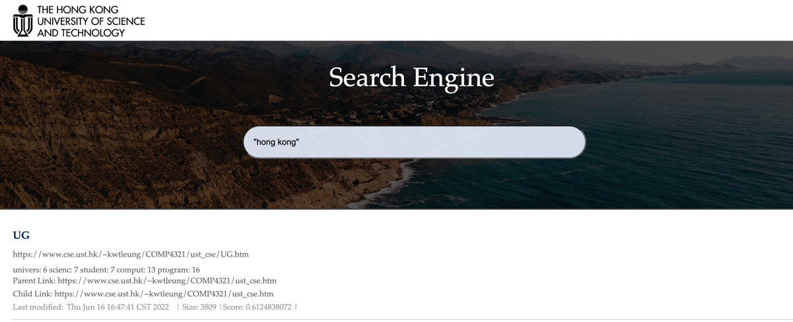

# CSIT5930-Project
## Team Members - Group9

| Name          | Student ID |
|---------------|------------|
| CHEN, Chen    | 20881450  |
| LONG, Shiyao    | 20932120  |
| SU, Lei | 20920567     |

----

We use IntelliJ IDEA instead of command line operation to simplify the installation and running of our system.

We use the embedded database RocksDB to store our index files, so there is no need to download additional DBMS.

## Requirements
- IntelliJ IDEA
- JDK 1.8
- Maven 3

## Installation
1. Open IntelliJ IDEA, and click on "Open" from the "File" menu. Select the project's root directory (the one containing the pom.xml file).

2. IntelliJ IDEA should automatically detect the pom.xml file and install all needed dependencies.

## Running
1. In IntelliJ IDEA, find the **Main class** and run it to perform data preprocessing (crawl, index, page rank).

2. After step 1 is complete (showing "page rank end"), run the **SearchEngineApplication class** to start the search engine.

3. Visit the following URL in your web browser: http://localhost:8080/

## Search
1. Input **"hong kong"** to test the phrase search.
2. Input **international news** to test the title favor.
3. Input **movie** to test the page rank.